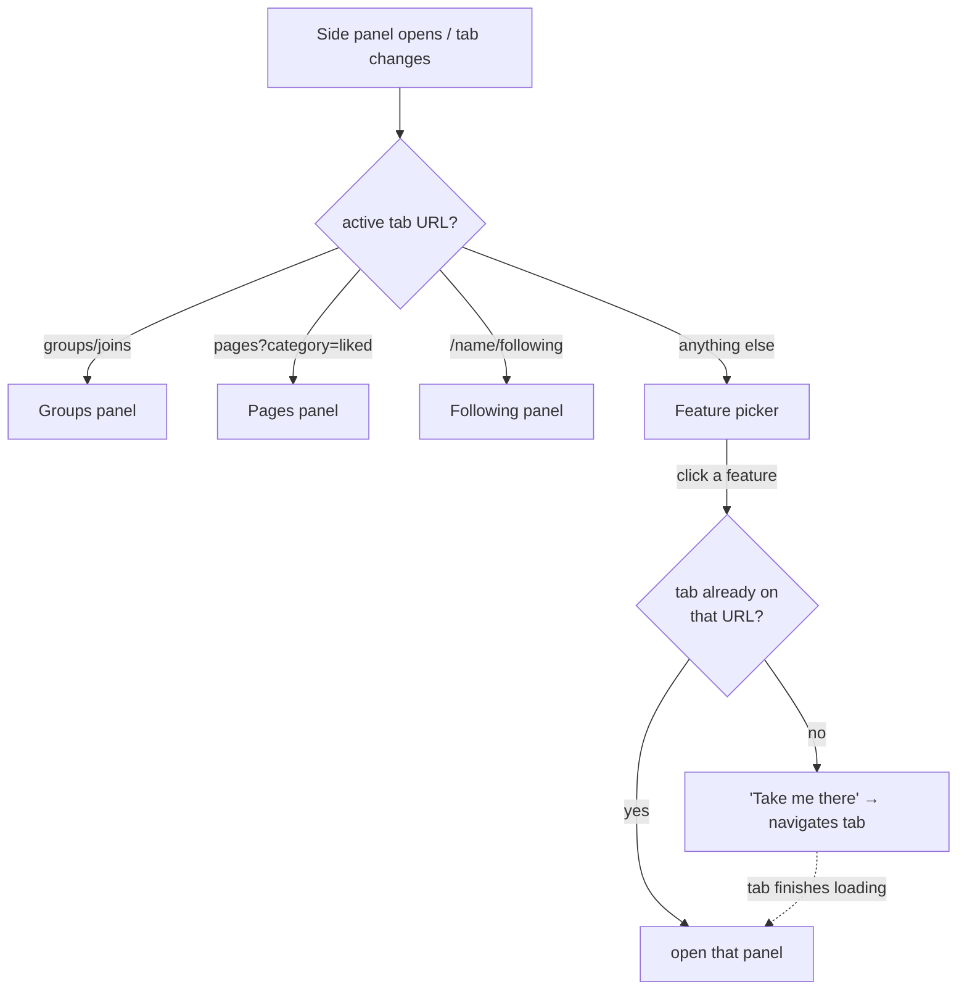
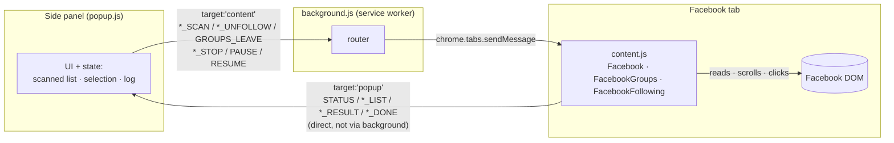
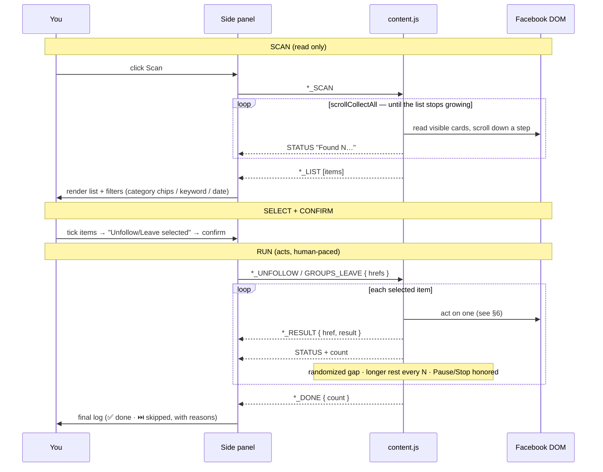

# Social Cleaner — Architecture & Execution Flow

How the extension is wired together and what happens, step by step, when you use
it. Everything below reflects the actual code in `content/content.js`, `popup/`,
and `background.js`.

---

## 1. Components

| File | Runs in | Responsibility |
|---|---|---|
| `manifest.json` | — | MV3 config. Registers the content script (Facebook/Instagram/Twitter/X), the background service worker, and the **side panel** (`popup/popup.html`). Permissions: `activeTab`, `sidePanel`. |
| `popup/popup.html` + `popup.js` + `popup.css` | Side panel (an extension page) | The UI. Platform tabs → feature picker → per-feature flow (scan → filter → confirm → run). Holds the scanned list, selection, and per-run log **in memory** while open. |
| `background.js` | Service worker | Opens the side panel on toolbar-icon click, and forwards `popup → content` messages to the active tab's content script (swallowing "no content script" errors cleanly). |
| `content/content.js` | Injected into the Facebook page | All the real work: reads the DOM, scrolls, clicks, reports progress. Contains three live modules — `Facebook` (pages), `FacebookGroups`, `FacebookFollowing` — plus `Instagram`/`Twitter` placeholders and the shared `scrollCollectAll` scraper. |

The UI opens as a **side panel** (not a popup), so it stays open while you scroll
Facebook and persists across tab switches.

---

## 2. Navigation model (the UI is a small state machine)

The side panel shows exactly one **screen** at a time:

- **picker** — the Facebook feature list (Pages / Groups / Following)
- **coming-soon** — splash for the Instagram / Twitter / LinkedIn tabs
- **wrong-url** — "Take me there" when a feature needs a specific Facebook URL
- **feature** — the active flow (one of the three panels below)

Platform **tabs** (Facebook / Instagram / X / LinkedIn) sit above every screen.

**Routing is URL-based**, decided entirely in the popup — no round-trip to the
content script:

```
on open / on tab change:
  url = active tab URL
  if url matches groups/joins        → Groups feature
  elif url matches pages?category=liked → Pages feature
  elif url matches /<name>/following → Following feature
  else                               → picker

pick a feature button:
  if the tab is already on that feature's URL → open the feature panel
  else → show "wrong-url" with a button that navigates the tab there
```



---

## 3. How popup and content talk

Two directions, two mechanisms:

- **popup → content**: `chrome.runtime.sendMessage({ target: 'content', ... })`.
  The **background** worker catches it and relays it to the active tab with
  `chrome.tabs.sendMessage`. If the content script isn't there (wrong page, or a
  tab not reloaded after an update), background returns `{ error: 'no-content-script' }`
  and the popup shows a "reload the page" message instead of failing silently.
- **content → popup**: `chrome.runtime.sendMessage({ target: 'popup', ... })`,
  received by the popup **directly**. Background must NOT re-broadcast these — doing
  so once caused every message (and every log row / counter tick) to arrive twice.



### Message types

| Type | Direction | Meaning |
|---|---|---|
| `PAGES_SCAN` / `GROUPS_SCAN` / `FOLLOWING_SCAN` | popup → content | Start a scan (Groups scan also carries `minDays`) |
| `PAGES_UNFOLLOW` / `FOLLOWING_UNFOLLOW` / `GROUPS_LEAVE` | popup → content | Act on the selected `hrefs` |
| `PAGES_STOP` / `GROUPS_STOP` / `FOLLOWING_STOP` | popup → content | Stop after the current item |
| `PAUSE` / `RESUME` | popup → content | Pause/resume the active run (any mode) |
| `STATUS` | content → popup | Progress text + live count |
| `PAGES_LIST` / `GROUPS_LIST` / `FOLLOWING_LIST` | content → popup | The scanned items |
| `PAGE_RESULT` / `GROUP_RESULT` / `FOLLOWING_RESULT` | content → popup | One item's outcome `{ href, result }` |
| `PAGES_DONE` / `GROUPS_DONE` / `FOLLOWING_DONE` | content → popup | Run finished (or stopped) |

---

## 4. The universal flow: scan → filter → confirm → run

All three features share the same four-step shape. The popup is the brain; the
content script is the hands.



### Filters per feature

| Feature | Surface | Filters offered |
|---|---|---|
| **Pages** | `facebook.com/pages/?category=liked` | Category chips (auto-derived, OR-matched) + keyword |
| **Groups** | `facebook.com/groups/joins` | "Not visited in X" (date) at scan time + keyword |
| **Following** | `facebook.com/<name>/following` | Keyword (name substring, comma = OR) |

---

## 5. `scrollCollectAll` — the robust scraper

Every scan uses one shared helper to walk a lazy-loading, infinite-scroll list
without missing items or quitting early:

- **Scrolls incrementally** (a step smaller than the viewport) so consecutive
  reads overlap — safe even when Facebook virtualizes the list and drops
  off-screen cards from the DOM.
- **Treats item-count, page-height, *or* scroll-position growth as progress** — so
  a slow lazy-load batch never looks like "the end."
- **Stops only after several consecutive rounds of genuinely no progress** (not
  just no new items), then returns the deduped set.

This replaced per-scan loops that gave up after a few quiet rounds and so
under-scanned long lists (e.g. 120 of 159 pages).

---

## 6. Acting on one item

Each feature's per-item routine, and how success is confirmed:

| Feature | Steps | Success signal |
|---|---|---|
| **Pages** | Click the row's **Following** button (silent — no menu/dialog) | Button flips **Following → Follow** (or detaches) |
| **Groups** | ⋯ menu → **Leave group** → confirm dialog → confirm | Confirm button detaches / card gone / "left group" prompt appears |
| **Following** | ⋯ menu (opened via a full pointer-event sequence — a plain click won't) → **Unfollow** | The menu item detaches from the DOM |

Common result codes shown in the log: `ok`, `already-left` (Groups), `not-found`
(virtualized off-screen), `no-menu`, `no-confirm`, `unconfirmed`.

Post-action popups (e.g. Facebook's "report this group?" prompt) are dismissed via
their **Close (X)** only — never by clicking a report/reason row.

---

## 7. Safety & anti-flag design

- **Human pacing** — every wait is randomized; runs insert short gaps between items
  and longer rests every N items. Nothing happens on a fixed beat.
- **Pause / Resume / Stop** — Pause halts before the next item and holds position
  (interruptible sleeps mean paused runs don't burn their rest timers); Resume
  continues the same queue; Stop abandons it. Pause is honored between items and
  inside every long wait.
- **Confirm before acting** — leaving groups is irreversible for private groups, so
  every run has an explicit confirm step and only ever touches the items you ticked.
- **Facebook's persistent hidden dialog** — the pages/groups DOM always keeps one
  hidden `[role="dialog"]`; overlay logic recognizes *our* menus/dialogs by content
  and ignores that one.

---

## 8. State — who remembers what

- **Side panel** holds the scanned list, the current selection, and the per-run
  log — all **in memory**. Closing the panel loses them (the content script keeps
  running in the page regardless). Re-open → re-scan.
- **content.js modules** each hold `_running`, `_paused`, `_stop`, and a count for
  the active run. `_running` prevents a second concurrent run in the same tab.

---

## 9. Extending it

Each platform/surface is a self-contained IIFE module in `content/content.js`
(content scripts can't use ES modules). A module exposes `isValidPage()`, `scan()`,
an action method, plus `stop()` / `pause()` / `resume()`. See
[CONTRIBUTING.md](CONTRIBUTING.md) for the full recipe.
